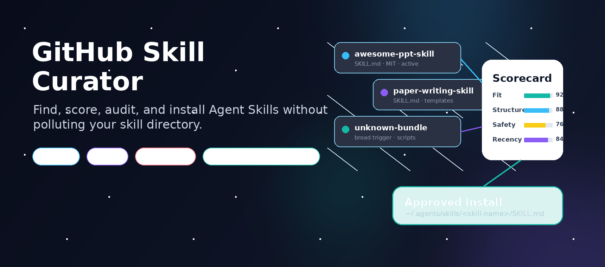
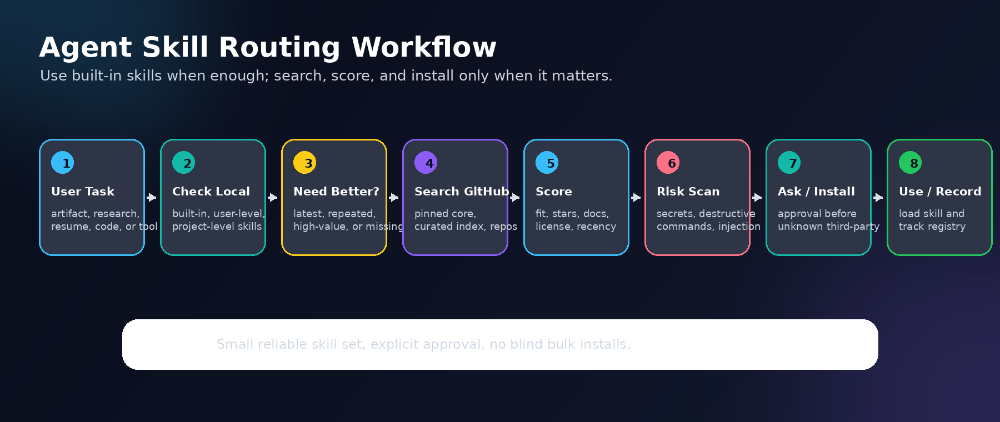
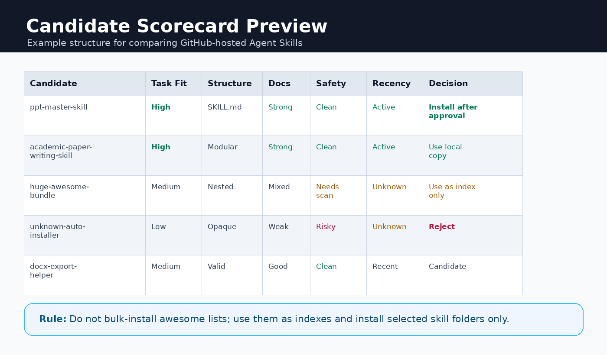
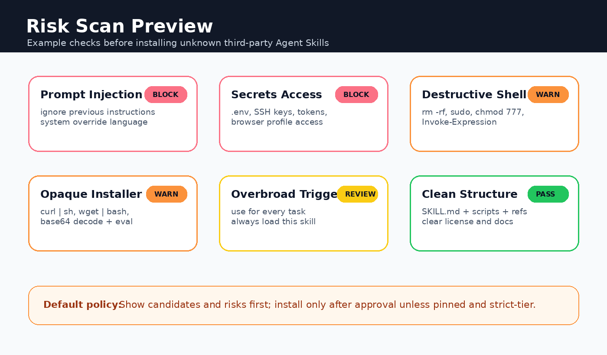

<div align="center">

<p>
  
</p>

# GitHub Skill Curator

<p>
  <a href="https://github.com/xcl2005/github-skill-curator/stargazers"><b>GitHub stars</b></a>
  &nbsp;|&nbsp;
  <a href="https://github.com/xcl2005/github-skill-curator/network/members"><b>Forks</b></a>
  &nbsp;|&nbsp;
  <a href="https://github.com/xcl2005/github-skill-curator/blob/main/LICENSE"><b>MIT License</b></a>
  &nbsp;|&nbsp;
  <b>Review First</b>
  &nbsp;|&nbsp;
  <b>No Blind Bulk Installs</b>
</p>

<p><sub>独立社区项目，不声明任何平台官方背书。Independent community project; no platform endorsement implied.</sub></p>

<p>
  <b>帮 Codex / Claude Code 找到更好的 Agent Skills，同时避免技能目录被污染。</b><br>
  <b>Find, score, audit, and install Agent Skills without polluting your skill directory.</b>
</p>

<p>
  <a href="#-快速开始"><b>🚀 快速开始</b></a>
  &nbsp;|&nbsp;
  <a href="#-控制流程"><b>🧭 控制流程</b></a>
  &nbsp;|&nbsp;
  <a href="#-scorecard--risk-scan"><b>🛡️ Scorecard & Risk Scan</b></a>
  &nbsp;|&nbsp;
  <a href="README_EN.md"><b>English</b></a>
</p>

</div>

## 🔥 最新定位

这个仓库是一个 skill 采购、路由和治理层。它先检查本地 skill，再判断是否值得搜索 GitHub；搜索后会评分、做风险扫描、展示候选，并且默认只在用户批准后安装选中的 skill 文件夹。

它面向的不只是 Codex 用户。Agent Skills 的核心结构是 `skill-name/SKILL.md` 加可选的 `scripts/`、`references/`、`assets/`，Codex 与 Claude Code 的差异主要在安装路径和显式调用方式。

## ✨ 为什么需要

Agent Skill 很有用，但技能目录一旦变乱，agent 会变慢、误触发，甚至被过宽的 `description` 带偏。

**GitHub Skill Curator** 的目标不是“搜到就装”，而是帮你回答三个问题：

| 问题 | Curator 的处理 |
|---|---|
| 现在已有 skill 是否够用？ | 先检查内置、用户级和项目级 skill |
| GitHub 上是否有更好的？ | 只在高价值、重复、最新/高 star 或本地能力不足时搜索 |
| 装了之后会不会不用？ | 一旦用户批准安装，默认立刻读取新 skill 并用于当前任务 |

## 👨‍💻 适用场景

| 场景 | 默认路线 |
|---|---|
| PPTX / DOCX / PDF / XLSX 等重复产物工作流 | 先查 pinned core，再决定是否安装 |
| 学术写作、LaTeX、简历、申请材料 | 运行高价值任务雷达 |
| 用户要求 GitHub 上的 latest / best / high-star 候选 | 强制刷新 GitHub 搜索 |
| 已装 skill 过宽、陈旧、误触发 | 审计、禁用、隔离或替换 |
| 低价值一次性任务 | 直接完成，不为了“可能有用”而安装 |

## 🎯 能力亮点

| | 能力 |
|---|---|
| 🔎 | 搜索包含 `SKILL.md` 的 Codex / Claude Code / Agent Skills 风格仓库 |
| 🧭 | 在内置能力、本地 skill、GitHub 搜索、安装、拒绝风险候选之间路由 |
| ⭐ | 按任务匹配、star、fork、维护时间、license、结构、文档和例子评分 |
| 🛡️ | 标记过宽触发、密钥访问、破坏性命令、prompt injection、不透明安装脚本 |
| 📦 | 只安装选中的 skill 文件夹，不默认污染整个仓库 |
| 🔁 | 安装成功后输出 Codex / Claude Code 的精确调用方式 |

## 📦 快速开始

### Codex 用户

```bash
mkdir -p ~/.agents/skills
git clone https://github.com/xcl2005/github-skill-curator.git ~/.agents/skills/github-skill-curator
```

Windows PowerShell:

```powershell
New-Item -ItemType Directory -Force -Path "$HOME\.agents\skills"
git clone https://github.com/xcl2005/github-skill-curator.git "$HOME\.agents\skills\github-skill-curator"
```

调用方式：

```text
使用 $github-skill-curator 帮我找一个高质量、可复用的 PPTX skill，并说明是否值得安装。
```

### Claude Code 用户

```bash
mkdir -p ~/.claude/skills
git clone https://github.com/xcl2005/github-skill-curator.git ~/.claude/skills/github-skill-curator
```

直接调用：

```text
/github-skill-curator find a high-quality reusable PPTX skill and install it if approved
```

### 安装候选 skill

```bash
# 安装到 Codex 默认目录
python scripts/install_skill.py owner/repo --skill-path path/to/skill --agent codex

# 安装到 Claude Code 默认目录
python scripts/install_skill.py owner/repo --skill-path path/to/skill --agent claude

# 同时安装到 Codex 与 Claude Code 默认目录
python scripts/install_skill.py owner/repo --skill-path path/to/skill --agent both
```

## 🔁 Codex / Claude Code

| 项目 | Codex | Claude Code |
|---|---|---|
| 共享结构 | `skill-name/SKILL.md`，可带 `scripts/`、`references/`、`assets/` | 同左 |
| 用户级路径 | `~/.agents/skills/<skill-name>` | `~/.claude/skills/<skill-name>` |
| 项目级路径 | `.agents/skills/<skill-name>` | `.claude/skills/<skill-name>` |
| 自动触发 | 依赖 `description` 与任务匹配 | 依赖 `description` 与任务匹配 |
| 显式调用 | `$skill-name ...` | `/skill-name ...` |
| 安装脚本 | `--agent codex` | `--agent claude` |

Claude.ai / Claude API 的自定义 skill 一般通过 zip 上传或 Skills API 注册；本仓库的 GitHub clone 安装命令主要面向本地 Codex 与 Claude Code。

## 🚀 安装后调用

如果用户已经批准安装某个 skill，这通常说明当前 skill 不够好、没有安装，或用户明确想升级。因此安装成功后默认行为是：

| 情况 | 行为 |
|---|---|
| 当前任务仍然匹配新 skill | 立即读取已安装的 `SKILL.md`，并用它继续当前任务 |
| 当前 agent 不能热加载新 skill | 输出精确路径和下一条调用命令 |
| 用户只是让你安装，不要执行任务 | 只安装并给出验证命令 |
| 安装后发现 skill 不匹配或有风险 | 不调用，说明原因并建议禁用或移除 |

安装脚本会打印类似下面的调用方式：

```text
Codex: Use $skill-name to ...
Claude Code: /skill-name ...
```

## 🧭 控制流程

<p align="center">
  
</p>

| 步骤 | 决策点 | 行为 |
|---:|---|---|
| 1 | 任务分类 | 提取 `pptx`、`latex`、`resume`、`research`、`docx`、`pdf`、框架名等关键词 |
| 2 | 检查本地 | 先检查用户级、项目级和配置目录里的 skill |
| 3 | 判断新鲜度 | 只在用户要最新/最佳、任务高价值或本地能力不足时搜索 |
| 4 | 选择发现通道 | pinned core、高价值任务雷达、curated index、通用 GitHub 搜索 |
| 5 | 候选评分 | 比较相关性、star、fork、维护时间、license、结构、文档和触发描述 |
| 6 | 风险扫描 | 检查 prompt injection、密钥访问、破坏性命令、过宽触发、不透明安装器 |
| 7 | 安装确认 | 展示候选和风险，只在用户批准后安装选中的 skill 文件夹 |
| 8 | 立即使用 | 安装成功后读取新 skill，并用于当前任务或输出显式调用命令 |

## 🛡️ Scorecard & Risk Scan

| Candidate Scorecard | Risk Scan |
|---|---|
|  |  |

> These are example review structures. The curator should still inspect the actual repository before recommending or installing any skill.

## 🛠️ 常用命令

```bash
# 查找 skill 候选
python scripts/find_skills.py "PowerPoint PPTX editable presentation Agent Skill" --top 8

# 先查 curated index
python scripts/find_curated_indexes.py "AI presentation Agent Skills" --top 8

# 分类高价值任务
python scripts/task_skill_radar.py "tailor my CS internship resume to this JD"

# 审计本地 skill
python scripts/audit_skills.py audit --dest "$HOME/.agents/skills"

# 检查 PPTX pinned core skill
python scripts/ensure_core_skills.py pptx
```

## 🛡️ 安全策略

这个项目把 skill 安装视为一个小型供应链决策。

它会关注：

- "use for all tasks" 这类过宽描述；
- prompt injection 语言；
- 密钥、token、`.env`、SSH key 访问模式；
- 破坏性 shell 命令；
- `curl | sh` 这类不透明安装方式；
- stale、重复、互相覆盖的 skill。

它不能证明第三方 skill 一定安全，但会让安装前的风险变得可见。

## 📁 仓库结构

```text
.
|-- SKILL.md
|-- scripts/
|-- references/
|-- examples/
|-- agents/
|-- README.md
`-- README_EN.md
```

## 🔎 搜索关键词

Codex skills, Claude Code skills, Agent Skills, GitHub skill discovery, skill governance, skill installer, prompt safety, AI agents, Codex CLI, developer tools.

## 📄 许可证

MIT
