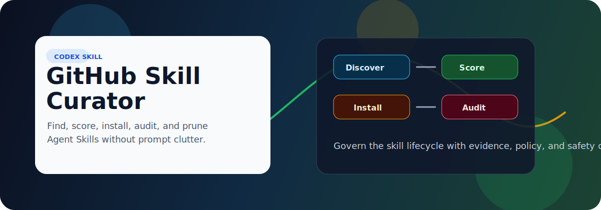
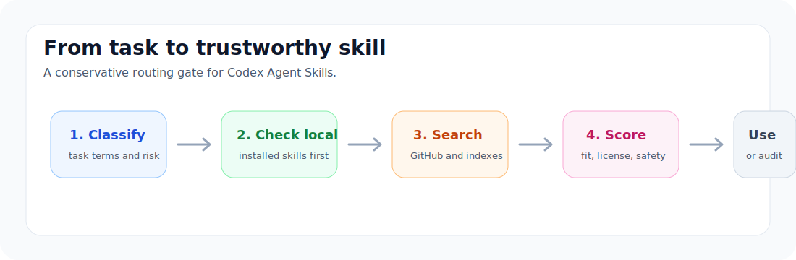
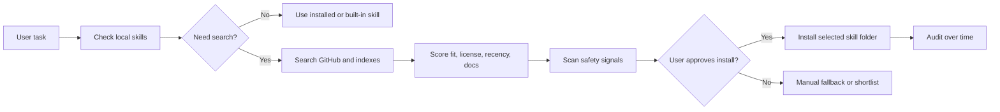

<p align="center">
  
</p>

# GitHub Skill Curator

<p>
  <a href="https://github.com/xcl2005/github-skill-curator/stargazers"></a>
  <a href="https://github.com/xcl2005/github-skill-curator/blob/main/LICENSE"></a>
  
  
</p>

**A governance skill for discovering, scoring, installing, auditing, and pruning Codex Agent Skills from GitHub.**

Use it when you want specialist agent skills, but you do not want random prompt bundles, stale scripts, or broad "do everything" instructions quietly taking over your Codex environment.

**Search keywords:** Codex skills, Agent Skills, GitHub skill discovery, skill installer, skill governance, prompt safety, agent workflow, AI coding assistant, Codex CLI, Claude Code skills, skill lifecycle management.

## Why download it

Most agent-skill setups fail in one of two ways: they never discover the useful specialized skill, or they install too many noisy skills and make the agent worse. GitHub Skill Curator gives Codex a conservative middle path.

| You need | This skill gives you |
|---|---|
| Find better Agent Skills on GitHub | Candidate search for repositories containing `SKILL.md` |
| Avoid junk installs | Scoring by task fit, stars, forks, recency, license, structure, docs, and safety signals |
| Keep Codex responsive | Local skills and built-in skills are checked before web search |
| Support high-value work | Radar for academic writing, LaTeX, resumes, documents, PPTX, PDF, XLSX, and reports |
| Clean up over time | Audit, disable, quarantine, restore, and prune workflows |

<p align="center">
  
</p>

## What makes it different

- **Governance-first:** it decides whether a skill is worth using before installing anything.
- **Approval-first installs:** unknown third-party skills are presented with evidence before installation.
- **Safety-aware scans:** flags secret access, destructive commands, opaque installers, obfuscated scripts, and overbroad triggers.
- **Curated index support:** uses awesome lists as discovery sources, not as blind trust.
- **Lifecycle management:** audits your skill folder and helps disable noisy or stale skills instead of deleting first.

## Project links

- [Examples](examples/) for real commands and task patterns.
- [Contributing guide](CONTRIBUTING.md) for scoring, safety, and discovery improvements.
- [Security policy](SECURITY.md) for reporting unsafe skill behavior.
- [Governance guide](references/governance.md) for long-term skill lifecycle management.

## Install

Clone directly into your user-wide Codex skills folder:

```bash
mkdir -p ~/.agents/skills
git clone https://github.com/xcl2005/github-skill-curator.git ~/.agents/skills/github-skill-curator
```

Windows PowerShell:

```powershell
New-Item -ItemType Directory -Force -Path "$HOME\.agents\skills"
git clone https://github.com/xcl2005/github-skill-curator.git "$HOME\.agents\skills\github-skill-curator"
```

Restart Codex if the skill does not appear automatically.

## Quick start

Ask Codex:

```text
$github-skill-curator find the best current PowerPoint skill for editable slide decks
```

Run a high-value task radar:

```bash
python scripts/task_skill_radar.py "tailor my CS internship resume to this job description"
```

Force fresh discovery for important work:

```bash
python scripts/task_skill_radar.py "write and format an IEEE-style research paper" --run-search --force-refresh
```

Audit installed skills:

```bash
python scripts/audit_skills.py audit --dest "$HOME/.agents/skills"
```

## Core workflows

| Command | Purpose |
|---|---|
| `scripts/task_skill_radar.py` | Classify high-value tasks and decide whether skill search is worth it |
| `scripts/find_skills.py` | Search GitHub for candidate Agent Skills |
| `scripts/find_curated_indexes.py` | Find curated indexes and awesome lists |
| `scripts/build_skill_roundup.py` | Build a reviewable shortlist when no index is strong enough |
| `scripts/install_skill.py` | Install a selected skill folder after review |
| `scripts/audit_skills.py` | Audit, disable, quarantine, restore, and prune local skills |
| `scripts/ensure_core_skills.py` | Maintain pinned reusable skills for clear artifact workflows |

## Safety model

This skill treats skill installation like a supply-chain decision:



It does not claim a third-party skill is "safe." It reports that a candidate looks acceptable based on scanned files, and keeps the final decision reviewable.

## Repository layout

```text
github-skill-curator/
|-- SKILL.md
|-- README.md
|-- agents/
|-- references/
|-- scripts/
|-- assets/
`-- LICENSE
```

## Best for

- Codex users who install multiple Agent Skills.
- Teams building reusable agent workflows.
- People working with PPTX, DOCX, PDF, XLSX, LaTeX, academic writing, resumes, reports, or codebase automation.
- Anyone who wants better skills without turning skill discovery into a risky copy-paste habit.

## Suggested GitHub topics

For maximum discoverability, use these topics on GitHub:

`codex`, `codex-skills`, `agent-skills`, `skill-discovery`, `skill-governance`, `ai-agents`, `prompt-safety`, `github`, `python`, `developer-tools`

## License

MIT. Use it, fork it, adapt it, and keep the skill ecosystem cleaner than you found it.
